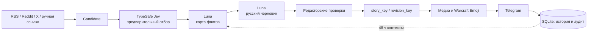
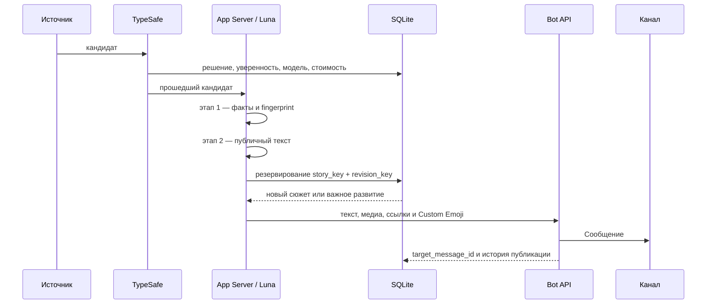

<div align="center">

# ⚔️ GildraNews

### Автономная редакция новостей World of Warcraft для Telegram

Собирает материалы из RSS, Reddit и X, отбирает полезные темы через TypeSafe,
проверяет факты и готовит русский текст через GPT-5.6 Luna, защищается от
повторов и публикует посты с подходящими медиа и игровыми Custom Emoji.

<br>

[](https://www.python.org)
[](https://www.docker.com)
[](https://aiogram.dev)
[](https://openai.com)
[](https://docs.typesafe.ai/introduction)
[](#-лицензия)

</div>

---

## 📋 Содержание

- [Что умеет](#-что-умеет)
- [Архитектура](#-архитектура)
- [Быстрый старт](#-быстрый-старт)
- [Команды бота](#-команды-бота)
- [Ручная публикация по ссылке](#-ручная-публикация-по-ссылке)
- [Premium-эмодзи](#-premium-эмодзи)
- [Еженедельный дайджест](#-еженедельный-дайджест)
- [Структура проекта](#-структура-проекта)
- [Конфигурация](#️-конфигурация)
- [Технологии](#-технологии)
- [Безопасность](#-безопасность)

---

## ✨ Что умеет

| | |
|---|---|
| **📡 Источники** | Wowhead RSS, Icy Veins RSS, RedditAPIs, GetXAPI и ручные ссылки |
| **🧠 Дешёвый отбор** | TypeSafe Jev классифицирует полезность, ветку WoW и статус информации до дорогой обработки |
| **🧾 Карта фактов** | Luna сначала выделяет подтверждающие цитаты и отпечаток события, а затем отдельным запросом пишет пост |
| **✍️ Русская редактура** | Простые фразы, контроль терминов WoW, чисел, версий, отрицаний, PTR и названий дополнений |
| **🚫 Защита от дублей** | SQLite хранит `story_key` и `revision_key`; разные источники одного сюжета дают одну публикацию |
| **🖼️ Медиа** | Оригинальные изображения и видео, SVG-инфографика и безопасный тематический fallback |
| **✨ Warcraft Emoji** | Иконки способностей, специализаций, рейдов, существ и дополнений разрешаются через Wowhead |
| **📰 Гибкое оформление** | Обычный пост или Telegram Rich Message выбирается по структуре материала, а не принудительно |
| **♻️ Очередь ошибок** | Временные сбои AI и редактора не выпускают сырой текст: кандидат ждёт автоматического повтора |
| **📊 Наблюдаемость** | `/status`, журнал прогонов, аудит TypeSafe, healthcheck контейнера и версионированные миграции |

---

## 🏗️ Архитектура



### Поток обработки одного поста



---

## 🚀 Быстрый старт

> Требуется Docker с Compose. Telegram Premium у владельца MTProto-сессии нужен
> только для публикации Premium Custom Emoji.

### 1. Клонировать репо

```bash
git clone https://github.com/Gildra-Foundation/news.git
cd news
```

### 2. Заполнить `.env`

```bash
cp .env.example .env
```

Что вписать:

| Поле | Где взять |
|---|---|
| `TELEGRAM_READER_ENABLED` | `false` для RSS/web; `true` включает Telethon-reader |
| `MTPROTO_PUBLISHER_ENABLED` | `true` публикует через Premium-аккаунт; чужие каналы не читает |
| `TG_API_ID`, `TG_API_HASH` | Нужны для любого включённого MTProto-режима |
| `BOT_TOKEN` | [@BotFather](https://t.me/BotFather) → /newbot |
| `TARGET_CHANNEL` | `@название_канала` — бот должен быть **админом** |
| `ADMIN_USER_ID` | узнаете на шаге 4 |
| `GEMINI_API_KEY` | https://aistudio.google.com/apikey |
| `GEMINI_MODEL` | `gemini-3.1-flash-lite` (быстро/бесплатно) или `gemini-2.5-pro` |
| `RSS_ENABLED` | `true` включает автономный RSS-поллинг |
| `RSS_FEED_URLS` | RSS-ленты через запятую; по умолчанию Wowhead |

Опциональные ключи GetXAPI, RedditAPIs и Scrape.do удобно вводить без отображения
в терминале и без ручного редактирования `.env`:

```bash
gildranews-api-keys --enable-paid
```

Команда сохраняет `.env` с правами `0600`. Без `--enable-paid` она только
обновляет ключи; платные маршруты остаются выключенными.

### 3. Авторизация MTProto (опционально)

Чтобы Premium Custom Emoji отображались в канале без Fragment-улучшения имени,
включите `MTPROTO_PUBLISHER_ENABLED=true`. Эта сессия используется только для
резервной отправки, если Telegram отклонит нативную Rich Message. Основной путь
публикации статей использует Bot API `sendRichMessage`. Чтение Telegram-источников управляется отдельно через
`TELEGRAM_READER_ENABLED` и по умолчанию выключено.

Создайте пользовательскую сессию один раз:

```bash
docker compose run --rm newsbot python -m gildranews.init_session
```

Введите номер и код из служебного чата Telegram в приложении. Telegram может не
предлагать SMS. Сессия запишется в `data/userbot.session` и не должна покидать сервер.

### 4. Запуск

```bash
docker compose up -d
docker compose logs -f
```

Напишите боту `/start` в личке — он вернёт ваш `user_id`. Впишите в `.env`, перезапустите:

```bash
docker compose up -d --force-recreate
```

Готово. Real-time-обработчик ловит новые посты, поллинг каждые 30 мин страхует.

---

## 💬 Команды бота

> Все команды доступны **только админу** (по `ADMIN_USER_ID`).

| Команда | Что делает |
|---|---|
| `/start` | Список команд + ваш user_id |
| `/sources` | Текущие источники |
| `/add @канал` | Добавить источник + автоподписка userbot-а |
| `/remove @канал` | Удалить источник |
| `/run` | Прогон поллинга прямо сейчас |
| `/test [@канал]` | Опубликовать последний пост — для проверки стиля |
| `/digest` | Собрать и опубликовать недельный дайджест |
| `/status` | Итоги последнего прогона |
| `/emojiid` | Извлечь ID premium-эмодзи из пересланного сообщения |
| `/emojis` | Состояние Warcraft Custom Emoji и Fragment-интеграции |
| `/emoji_retry ID` | Вернуть неудачную загрузку в очередь |
| `/emoji_disable ID` | Отключить проблемную загрузку |
| `/cancel` | Отменить ожидание правки |

---

## 🔗 Ручная публикация по ссылке

Просто пришлите боту любую из ссылок:

| Сервис | Формат |
|---|---|
| 📢 Telegram | `t.me/канал/ID` |
| 𝕏 Twitter / X | `x.com/.../status/ID` или `twitter.com/...` |
| 👽 Reddit | `reddit.com/r/.../comments/ID/...` |
| 🐙 GitHub | `github.com/owner/repo` |

Бот:
1. Скачает контент (GetXAPI/RedditAPIs, если явно включены; затем бесплатные
   FxTwitter/Reddit JSON; при блокировке — явно включённый Scrape.do через ParsesUnix)
2. Проверит факты и подготовит русский текст через App Server с Luna
3. Отрендерит карточку через Pillow если нет родного фото
4. Покажет **превью с 4 кнопками**:

| Кнопка | Действие |
|---|---|
| ✏️ Редактировать | Бот ждёт текстовую инструкцию, после чего Luna пересоберёт текст |
| ✅ Опубликовать | Шлёт в канал + пишет в БД для будущего дедупа |
| 🔗 Оригинал в посте | Toggle: добавить курсивно-подчёркнутую ссылку в финал поста |
| ❌ Отменить | Удалить черновик и скриншот |

---

## 🏷️ Premium-эмодзи

Luna выделяет до трёх сущностей Warcraft: класс, специализацию, заклинание,
предмет, косметику, средство передвижения, рейд, подземелье, босса и другие.
Бот проверяет точное совпадение и ветку игры, скачивает оригинальную иконку,
приводит её к статическому WEBP 100×100 и сохраняет созданный
`custom_emoji_id` в SQLite.

В пост попадает не более двух Custom Emoji. При неоднозначном совпадении,
ошибке загрузки или отказе Telegram публикация продолжается с обычным
Unicode-эмодзи. Загрузка повторяется через очередь с ограничением 10 новых
эмодзи в сутки и не более 190 элементов в одном наборе.

Для использования Custom Emoji ботом в канале к боту должен быть привязан
дополнительный коллекционный username с Fragment. После привязки включите:

```ini
EMOJI_AUTOCREATE_ENABLED=true
```

Технические ограничения файлов и наборов описаны в
[Telegram Bot API](https://core.telegram.org/bots/api#addstickertoset) и
[руководстве Telegram по стикерам](https://core.telegram.org/stickers).

---

## 📅 Еженедельный дайджест


Раз в воскресенье в 18:00 UTC бот:
1. Достаёт все посты с `target_message_id` за последние 7 дней
2. Шлёт в Luna → структурированный JSON `{intro, sections: [{name, items}]}`
3. Собирает HTML с кликабельными ссылками вида `https://t.me/gildrawow/<id>`
4. Публикует **с обложкой** [`assets/digest_cover.jpg`](assets/digest_cover.jpg) и хэштегом `#дайджест@gildrawow`

Или вручную — `/digest` в личке.

---

## 📁 Структура проекта

```
.
├── src/gildranews/
│   ├── domain/                # Общие модели без зависимостей от SDK
│   ├── application/           # Pipeline, дайджест и контракты внешних компонентов
│   ├── adapters/
│   │   ├── ai/                # TypeSafe-отбор и ChatGPT App Server / Luna
│   │   ├── sources/           # Telegram, X, Reddit и GitHub
│   │   ├── publishing/        # Публикация через Telegram Bot API
│   │   ├── persistence/       # SQLite
│   │   ├── rendering/         # Карточки и инфографика Pillow
│   │   ├── emoji/             # Совместимость со старым каталогом emoji
│   │   └── warcraft/          # Иконки и Telegram Custom Emoji registry
│   ├── presentation/telegram/ # Команды, callbacks, уведомления и real-time события
│   ├── jobs/                  # Планировщик, cleanup и недельный дайджест
│   ├── config.py              # Типизированная конфигурация окружения
│   └── main.py                # Минимальная точка входа
├── tests/                     # Unit и integration-тесты
├── pyproject.toml             # Метаданные, зависимости и инструменты качества
├── Dockerfile                 # python:3.12-slim + fonts-dejavu
├── docker-compose.yml         # mem_limit 512m, cpus 1.0, restart unless-stopped
├── assets/
│   └── digest_cover.jpg       # Обложка для дайджеста
└── data/                      # Создаётся при первом запуске, не хранится в Git
    ├── userbot.session        # Telethon-сессия
    ├── newsbot.db             # SQLite с WAL
    ├── emoji_icons/           # Нормализованные игровые иконки 100×100
    └── screenshots/           # Временные карточки X/Reddit/GitHub
```

Локальная установка для разработки:

```bash
uv venv .venv --python 3.12
uv pip install --python .venv/bin/python -e '.[dev]'
.venv/bin/python -m pytest
.venv/bin/ruff check src tests
```

---

## ⚙️ Конфигурация

### .env переменные

```ini
# Telegram
TG_API_ID=12345678
TG_API_HASH=abcd1234...
BOT_TOKEN=1234:ABCdef...
TARGET_CHANNEL=@gildrawow
ADMIN_USER_ID=123456789

# Основной AI-провайдер
AI_PROVIDER=app_server
APP_SERVER_URL=http://host.docker.internal:4202/ag-ui
APP_SERVER_MODEL=gpt-5.6-luna
APP_SERVER_REASONING_EFFORT=xhigh

# Предварительный отбор TypeSafe через OpenRouter
NEWS_SELECTOR_ENABLED=true
NEWS_SELECTOR_MODEL=typesafe/jev-1.13
NEWS_SELECTOR_MIN_REJECT_CONFIDENCE=0.90
NEWS_SELECTOR_SHADOW_MODE=false
OPENROUTER_API_KEY_FILE=/app/data/openrouter_api_key

# Опциональные платные маршруты (без enabled=true запросов не будет)
GETXAPI_KEY=...
GETXAPI_ENABLED=false
REDDITAPIS_KEY=...
REDDITAPIS_ENABLED=false
REDDIT_MAX_POSTS_PER_DAY=2
X_MAX_POSTS_PER_DAY=2
SCRAPE_DO_TOKEN=...
SCRAPE_DO_ENABLED=false

# Расписание
LOOKBACK_MINUTES=45         # окно поллинга
INTERVAL_MINUTES=30         # период safety-net
MAX_POSTS_PER_RUN=3

# Warcraft Custom Emoji после привязки Fragment username
EMOJI_AUTOCREATE_ENABLED=true
EMOJI_MAX_NEW_PER_DAY=10
EMOJI_UPLOAD_TIMEOUT_SECONDS=15
SUBSCRIBE_EMOJI_ID=5280756831252167912
FOREVER_GUIDE_MESSAGE_ID=44
FOREVER_GUIDE_REFRESH_MINUTES=30
FOREVER_RELEASE_DATE=2026-11-04
```

Реестр игровых сущностей, хэшей изображений, очереди и `custom_emoji_id`
хранится в таблицах `warcraft_entities` и `telegram_emoji_assets` базы
`data/newsbot.db`; ручной файл `data/emojis.json` для этого конвейера не нужен.

Отпечатки сюжетов и суточные квоты Reddit/X также хранятся в SQLite. Один и
тот же сюжет из разных источников резервируется атомарно, а перезапуск бота не
обнуляет лимит в два поста Reddit и два поста X за сутки.

Если задан `FOREVER_GUIDE_MESSAGE_ID`, бот каждые 30 минут обновляет закреплённое
оглавление ссылками на новые публикации о WoW: Forever. Редактирование идёт через
MTProto, поэтому Premium Emoji сохраняются, а в дату `FOREVER_RELEASE_DATE`
автоматическое пополнение прекращается.

---

## 🧰 Технологии

| Слой | Стек |
|---|---|
| **Источники** | RSS, RedditAPIs, GetXAPI и ручные ссылки; чтение Telegram по умолчанию выключено |
| **Публикация и команды** | aiogram 3.x (Bot API) |
| **AI** | TypeSafe Jev через OpenRouter Decisions API и GPT-5.6 Luna через App Server |
| **Internet-fetch** | httpx, ParsesUnix/Scrape.do и безопасные адаптеры источников |
| **Рендер** | Pillow и SVG-шаблоны с поддержкой кириллицы |
| **Хранилище** | aiosqlite, WAL, версионированные миграции и атомарное резервирование публикаций |
| **Расписание** | APScheduler: RSS, Reddit/X утром и вечером, повторы и еженедельный дайджест |
| **Деплой** | Docker Compose, lock-файлы с хэшами и встроенный healthcheck |
| **Лимиты** | mem 512MB, CPU 1.0, лог-ротация 10MB×5 |

### Производительность

| Метрика | Значение |
|---|---|
| RAM в idle | ~150 MiB |
| CPU в idle | <0.05% |
| Один пост: fetch → filter → publish | зависит от App Server; тайм-аут одного запроса 240 секунд |
| Соединения | MTProto-сессия в volume, httpx keep-alive, AI-запросы сериализованы |

---

## 🛡️ Безопасность

- ✅ `.env` в `.gitignore` — секреты не попадают в репо
- ✅ `*.session` — Telethon-сессия даёт **полный доступ к аккаунту**, никому не передавайте
- ✅ `data/` — БД и временные файлы тоже игнорируются git-ом
- ✅ Все команды бота — только для `ADMIN_USER_ID`
- ✅ SQLite в WAL-режиме, безопасные транзакции
- ✅ FloodWait и rate-limit обрабатываются с retry
- ✅ `mem_limit` 512MB — при утечке OOM-killer прибьёт контейнер, `restart: unless-stopped` поднимет

---

## 🧱 Построено с использованием

| Репозиторий | Что даёт |
|---|---|
| **[BotForge / telegram-skills](https://github.com/Zulut30/telegram-skills)** | Skill pack для AI-ассистентов (Claude Code, Cursor, Codex), который превращает LLM в senior Telegram-bot-инженера: модульная архитектура, Bot API 9.6, rate-limits, Docker, миграции — всё по канону, без монолитов |
| **[premium-telegram-emoji](https://github.com/Zulut30/premium-telegram-emoji)** | Каталог premium-эмодзи Telegram с custom-emoji-id, готовыми HTML-сниппетами и гайдом «как заставить бот отправлять анимированные эмодзи в каналы» |

Оба репозитория поддерживает [@Zulut30](https://github.com/Zulut30).

---

## 📝 Лицензия

MIT — делайте что хотите, но без гарантий.

---

<div align="center">

**⭐ Понравилось? Ставьте звезду — это лучший feedback.**

Made with ❤️ for content curators who hate spam.

</div>
