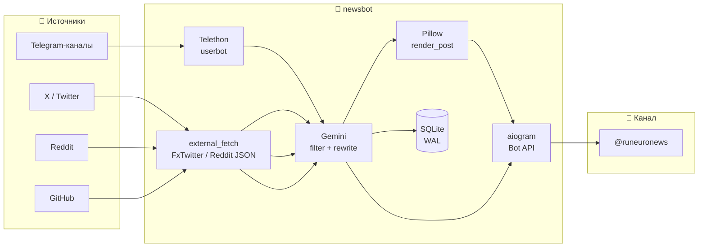
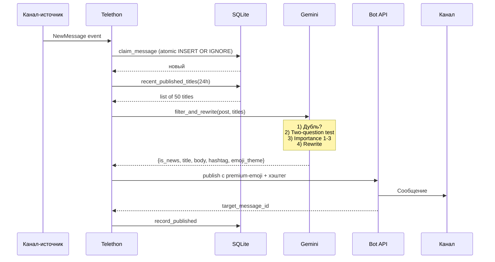

<div align="center">

# 🤖 RuNeuroNews Bot

### Telegram-агрегатор новостей про ИИ с AI-фильтрацией и рерайтом

Парсит десятки каналов через Telethon, отбирает важное через Gemini,
переписывает в живом стиле, публикует в целевой канал —
с premium-эмодзи, медиа, дедупликацией и еженедельным дайджестом.

<br>

[](https://www.python.org)
[](https://www.docker.com)
[](https://aiogram.dev)
[](https://docs.telethon.dev)
[](https://ai.google.dev)
[](#-лицензия)

</div>

---

## 📋 Содержание

- [Что умеет](#-что-умеет)
- [Архитектура](#-архитектура)
- [Быстрый старт](#-быстрый-старт)
- [Команды бота](#-команды-бота)
- [Ручная публикация по ссылке](#-ручная-публикация-по-ссылке)
- [Premium-эмодзи](#-premium-эмодзи)
- [Еженедельный дайджест](#-еженедельный-дайджест)
- [Структура проекта](#-структура-проекта)
- [Конфигурация](#️-конфигурация)
- [Технологии](#-технологии)
- [Безопасность](#-безопасность)

---

## ✨ Что умеет

| | |
|---|---|
| **🛰️ Real-time мониторинг** | Telethon NewMessage events на любом числе публичных Telegram-каналов |
| **🧠 AI-фильтр** | Gemini оценивает каждый пост: «важно для аудитории?» + «есть уникальный факт?» + важность 1–3 |
| **✍️ Качественный рерайт** | Не пересказ, а пересборка: меняется структура, заменяется канцелярит на живые глаголы |
| **🚫 Семантический дедуп** | Gemini сверяет с заголовками за 24 ч — одну новость из 5 каналов опубликует только раз |
| **🔗 Импорт по ссылке** | Пришлите боту t.me / x.com / reddit.com / github.com — превью с 4 кнопками |
| **🎨 Свои карточки** | Pillow рендерит фирменные cards для X / Reddit / GitHub когда нет родного фото |
| **🏷️ Premium-эмодзи** | 37 эмодзи с regex-override по контексту: упоминание «Claude» → лого Anthropic |
| **📅 Дайджест** | Раз в неделю — обзор главных постов канала с кликабельными ссылками |
| **🗂️ 6 хэштегов** | Gemini сам выбирает: #новости #руководство #советы #полезное #обсуждения #дайджест |
| **📊 Тематические лого** | Auto-detect Python/Go/Rust/JS, OpenAI/Anthropic/Google, GitHub/Reddit и т.д. |

---

## 🏗️ Архитектура



### Поток обработки одного поста



---

## 🚀 Быстрый старт

> Требуется OrbStack или Docker Desktop. Telegram Premium у владельца бота — желателен.

### 1. Клонировать репо

```bash
git clone https://github.com/Gildra-Foundation/news.git
cd news
```

### 2. Заполнить `.env`

```bash
cp .env.example .env
```

Что вписать:

| Поле | Где взять |
|---|---|
| `TELEGRAM_READER_ENABLED` | `false` для RSS/web; `true` включает Telethon-reader |
| `TG_API_ID`, `TG_API_HASH` | Нужны только при `TELEGRAM_READER_ENABLED=true` |
| `BOT_TOKEN` | [@BotFather](https://t.me/BotFather) → /newbot |
| `TARGET_CHANNEL` | `@название_канала` — бот должен быть **админом** |
| `ADMIN_USER_ID` | узнаете на шаге 4 |
| `GEMINI_API_KEY` | https://aistudio.google.com/apikey |
| `GEMINI_MODEL` | `gemini-3.1-flash-lite` (быстро/бесплатно) или `gemini-2.5-pro` |
| `RSS_ENABLED` | `true` включает автономный RSS-поллинг |
| `RSS_FEED_URLS` | RSS-ленты через запятую; по умолчанию Wowhead |

Опциональные ключи GetXAPI, RedditAPIs и Scrape.do удобно вводить без отображения
в терминале и без ручного редактирования `.env`:

```bash
gildranews-api-keys --enable-paid
```

Команда сохраняет `.env` с правами `0600`. Без `--enable-paid` она только
обновляет ключи; платные маршруты остаются выключенными.

### 3. Авторизация Telethon (опционально)

Для RSS и web-источников пропустите этот шаг: бот запускается через Bot API без
пользовательской Telegram-сессии и без SMS-кода.

Если позднее понадобится читать чужие Telegram-каналы, создайте сессию один раз:

```bash
docker compose run --rm newsbot python -m gildranews.init_session
```

Введите номер и SMS-код. Сессия запишется в `data/userbot.session`.

### 4. Запуск

```bash
docker compose up -d
docker compose logs -f
```

Напишите боту `/start` в личке — он вернёт ваш `user_id`. Впишите в `.env`, перезапустите:

```bash
docker compose up -d --force-recreate
```

Готово. Real-time-обработчик ловит новые посты, поллинг каждые 30 мин страхует.

---

## 💬 Команды бота

> Все команды доступны **только админу** (по `ADMIN_USER_ID`).

| Команда | Что делает |
|---|---|
| `/start` | Список команд + ваш user_id |
| `/sources` | Текущие источники |
| `/add @канал` | Добавить источник + автоподписка userbot-а |
| `/remove @канал` | Удалить источник |
| `/run` | Прогон поллинга прямо сейчас |
| `/test [@канал]` | Опубликовать последний пост — для проверки стиля |
| `/digest` | Собрать и опубликовать недельный дайджест |
| `/status` | Итоги последнего прогона |
| `/emojiid` | Извлечь ID premium-эмодзи из пересланного сообщения |
| `/cancel` | Отменить ожидание правки |

---

## 🔗 Ручная публикация по ссылке

Просто пришлите боту любую из ссылок:

| Сервис | Формат |
|---|---|
| 📢 Telegram | `t.me/канал/ID` |
| 𝕏 Twitter / X | `x.com/.../status/ID` или `twitter.com/...` |
| 👽 Reddit | `reddit.com/r/.../comments/ID/...` |
| 🐙 GitHub | `github.com/owner/repo` |

Бот:
1. Скачает контент (GetXAPI/RedditAPIs, если явно включены; затем бесплатные
   FxTwitter/Reddit JSON; при блокировке — явно включённый Scrape.do через ParsesUnix)
2. Переведёт + переформулирует через Gemini
3. Отрендерит карточку через Pillow если нет родного фото
4. Покажет **превью с 4 кнопками**:

| Кнопка | Действие |
|---|---|
| ✏️ Редактировать | Бот ждёт текстовую инструкцию правки, Gemini переделает |
| ✅ Опубликовать | Шлёт в канал + пишет в БД для будущего дедупа |
| 🔗 Оригинал в посте | Toggle: добавить курсивно-подчёркнутую ссылку в финал поста |
| ❌ Отменить | Удалить черновик и скриншот |

---

## 🏷️ Premium-эмодзи

37 анимированных эмодзи встраиваются перед заголовком каждого поста через `<tg-emoji emoji-id="…">` теги.

> 🗂️ Каталог ID и подробный гайд по premium-эмодзи в Telegram-ботах — отдельный репозиторий: **[Zulut30/premium-telegram-emoji](https://github.com/Zulut30/premium-telegram-emoji)**. Там полный список айдишников (новостные эмодзи, лого приложений, AI-компании, языки программирования), способы получить ID и примеры кода.

### Категории

| Группа | Что входит |
|---|---|
| **Общие** (11 шт.) | release, tool, model, research, business, regulation, tip, ux, case, viral, internet |
| **Лого AI-компаний** (10 шт.) | OpenAI/ChatGPT, Anthropic/Claude, Google/Gemini, xAI/Grok, DeepSeek, Qwen, Mistral, Perplexity, ElevenLabs, Copilot |
| **Платформы** (9 шт.) | GitHub, Telegram, Discord, Reddit, YouTube, Figma, Blender, Google Cloud, Microsoft |
| **Языки** (7 шт.) | Python, JavaScript, TypeScript, Go, Java, C++, Rust |

### Логика выбора

1. **Gemini** выбирает категорию (release / tool / model и т.п.) из общих
2. **Бот** проходит regex по title+body — если упомянуты «Claude», «Python», «GitHub» и т.п. — **подменяет** на конкретный лого
3. Если ничего не найдено — категория Gemini

> ⚠️ Bot API 9.4 разрешает premium-эмодзи только в private/group/supergroup чатах. В каналах — fallback на Unicode-эмодзи (на скрине: 🤖 🧠 🐍 👽). Premium-анимация заработает, когда Telegram откроет каналы в Bot API.

---

## 📅 Еженедельный дайджест

```mermaid
gantt
    title Цикл недели
    dateFormat HH:mm
    axisFormat %a
    section Бот
    Real-time + поллинг :a1, 00:00, 7d
    section Воскресенье
    Дайджест в 18:00 UTC :crit, 18:00, 0.5d
```



Раз в воскресенье в 18:00 UTC бот:
1. Достаёт все посты с `target_message_id` за последние 7 дней
2. Шлёт в Gemini → структурированный JSON `{intro, sections: [{name, items}]}`
3. Собирает HTML с кликабельными ссылками вида `https://t.me/runeuronews/<id>`
4. Публикует **с обложкой** [`assets/digest_cover.jpg`](assets/digest_cover.jpg) и хэштегом `#дайджест@runeuronews`

Или вручную — `/digest` в личке.

---

## 📁 Структура проекта

```
.
├── src/gildranews/
│   ├── domain/                # Общие модели без зависимостей от SDK
│   ├── application/           # Pipeline, дайджест и контракты внешних компонентов
│   ├── adapters/
│   │   ├── ai/                # AI-провайдеры; сейчас Gemini, далее ChatGPT Server
│   │   ├── sources/           # Telegram, X, Reddit и GitHub
│   │   ├── publishing/        # Публикация через Telegram Bot API
│   │   ├── persistence/       # SQLite
│   │   ├── rendering/         # Карточки и инфографика Pillow
│   │   └── emoji/             # Каталог и выбор emoji
│   ├── presentation/telegram/ # Команды, callbacks, уведомления и real-time события
│   ├── jobs/                  # Планировщик, cleanup и недельный дайджест
│   ├── config.py              # Типизированная конфигурация окружения
│   └── main.py                # Минимальная точка входа
├── tests/                     # Unit и integration-тесты
├── pyproject.toml             # Метаданные, зависимости и инструменты качества
├── Dockerfile                 # python:3.12-slim + fonts-dejavu
├── docker-compose.yml         # mem_limit 512m, cpus 1.0, restart unless-stopped
├── assets/
│   └── digest_cover.jpg       # Обложка для дайджеста
└── data/                      # Создаётся при первом запуске, не хранится в Git
    ├── userbot.session        # Telethon-сессия
    ├── newsbot.db             # SQLite с WAL
    ├── emojis.json            # Карта 37 эмодзи (можно править на лету)
    └── screenshots/           # Временные карточки X/Reddit/GitHub
```

Локальная установка для разработки:

```bash
uv venv .venv --python 3.12
uv pip install --python .venv/bin/python -e '.[dev]'
.venv/bin/python -m pytest
.venv/bin/ruff check src tests
```

---

## ⚙️ Конфигурация

### .env переменные

```ini
# Telegram
TG_API_ID=12345678
TG_API_HASH=abcd1234...
BOT_TOKEN=1234:ABCdef...
TARGET_CHANNEL=@runeuronews
ADMIN_USER_ID=123456789

# Gemini
GEMINI_API_KEY=AIzaSy...
GEMINI_MODEL=gemini-3.1-flash-lite

# Опциональные платные маршруты (без enabled=true запросов не будет)
GETXAPI_KEY=...
GETXAPI_ENABLED=false
REDDITAPIS_KEY=...
REDDITAPIS_ENABLED=false
SCRAPE_DO_TOKEN=...
SCRAPE_DO_ENABLED=false

# Расписание
LOOKBACK_MINUTES=45         # окно поллинга
INTERVAL_MINUTES=30         # период safety-net
MAX_POSTS_PER_RUN=3
```

### data/emojis.json

Карта премиум-эмодзи. Можно править руками — формат:

```json
{
  "logo_openai": {
    "id": "5945217417591397712",
    "fallback": "🤖",
    "desc": "лого OpenAI/ChatGPT",
    "match_pattern": "\\b(OpenAI|ChatGPT|GPT[- ]?[345Oo]|Sora|DALL[- ]?E)\\b"
  }
}
```

`match_pattern` — regex для auto-override по упоминанию в title+body. Без него — обычная категория для выбора Gemini.

---

## 🧰 Технологии

| Слой | Стек |
|---|---|
| **Чтение каналов** | Telethon 1.36+ (MTProto userbot) |
| **Публикация и команды** | aiogram 3.x (Bot API) |
| **AI** | google-genai (Gemini 3.1 / 2.5) с structured output через pydantic |
| **Internet-fetch** | httpx с persistent connection pool, FxTwitter API |
| **Рендер карточек** | Pillow с font-cache, шрифт DejaVu Sans (Unicode + кириллица) |
| **Хранилище** | aiosqlite + WAL + memory-mapped 64MB |
| **Расписание** | APScheduler — interval 30 min + cron weekly |
| **Деплой** | Docker (python:3.12-slim ~370MB) + OrbStack |
| **Лимиты** | mem 512MB, CPU 1.0, лог-ротация 10MB×5 |

### Производительность

| Метрика | Значение |
|---|---|
| RAM в idle | ~150 MiB |
| CPU в idle | <0.05% |
| Один пост: fetch → filter → publish | ~3–5 сек |
| Telethon-сессия persistent, httpx с keep-alive, Gemini-клиент кэширован |

---

## 🛡️ Безопасность

- ✅ `.env` в `.gitignore` — секреты не попадают в репо
- ✅ `*.session` — Telethon-сессия даёт **полный доступ к аккаунту**, никому не передавайте
- ✅ `data/` — БД и временные файлы тоже игнорируются git-ом
- ✅ Все команды бота — только для `ADMIN_USER_ID`
- ✅ SQLite в WAL-режиме, безопасные транзакции
- ✅ FloodWait и rate-limit обрабатываются с retry
- ✅ `mem_limit` 512MB — при утечке OOM-killer прибьёт контейнер, `restart: unless-stopped` поднимет

---

## 🧱 Построено с использованием

| Репозиторий | Что даёт |
|---|---|
| **[BotForge / telegram-skills](https://github.com/Zulut30/telegram-skills)** | Skill pack для AI-ассистентов (Claude Code, Cursor, Codex), который превращает LLM в senior Telegram-bot-инженера: модульная архитектура, Bot API 9.6, rate-limits, Docker, миграции — всё по канону, без монолитов |
| **[premium-telegram-emoji](https://github.com/Zulut30/premium-telegram-emoji)** | Каталог premium-эмодзи Telegram с custom-emoji-id, готовыми HTML-сниппетами и гайдом «как заставить бот отправлять анимированные эмодзи в каналы» |

Оба репозитория поддерживает [@Zulut30](https://github.com/Zulut30).

---

## 📝 Лицензия

MIT — делайте что хотите, но без гарантий.

---

<div align="center">

**⭐ Понравилось? Ставьте звезду — это лучший feedback.**

Made with ❤️ for content curators who hate spam.

</div>
